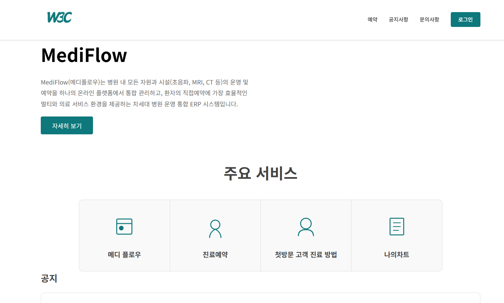
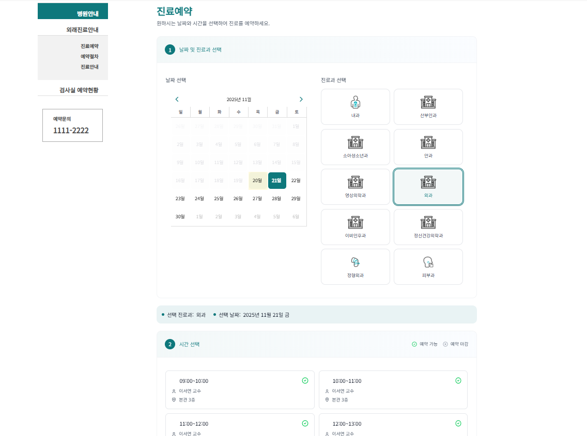
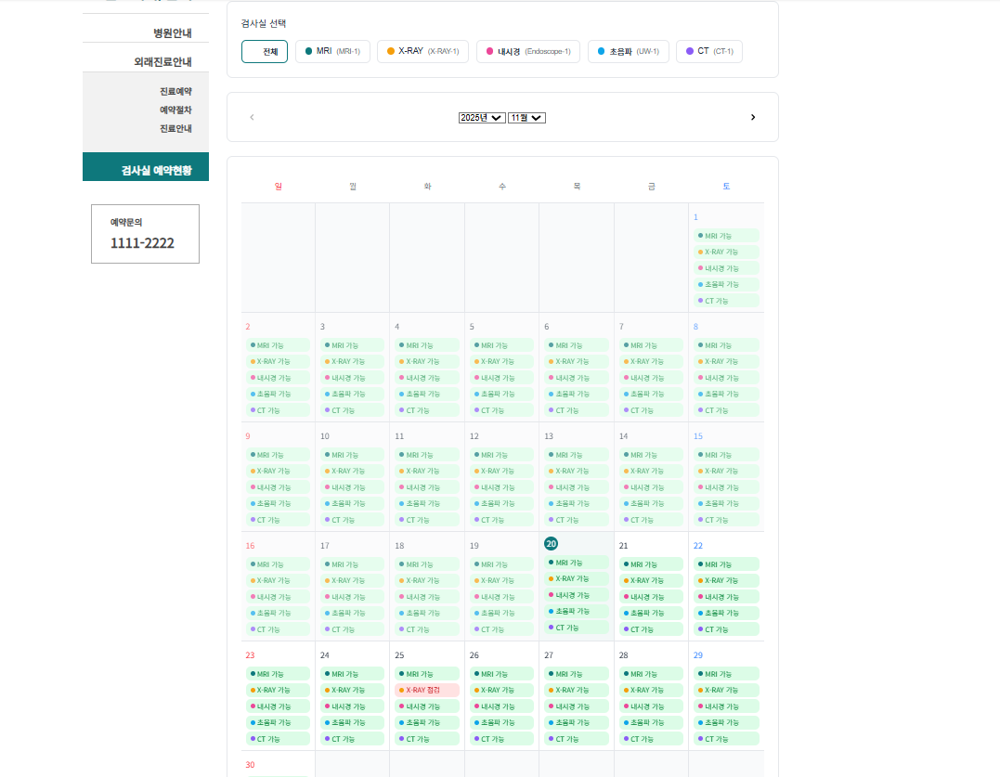
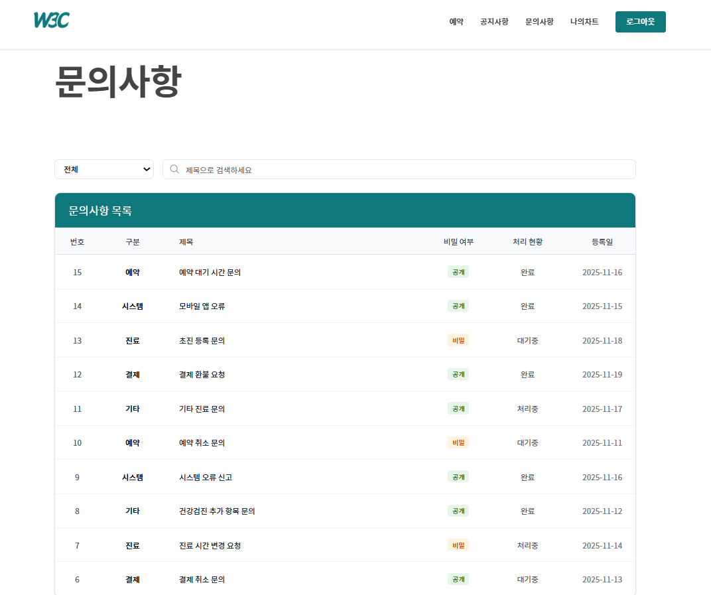
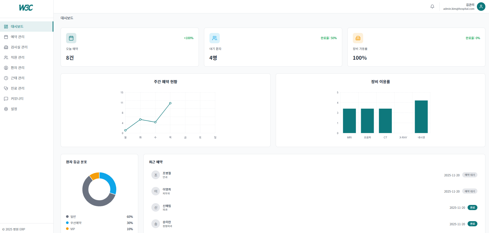
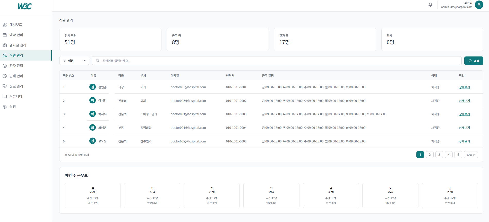
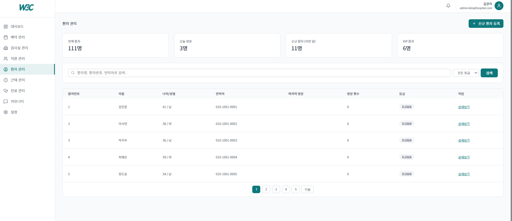
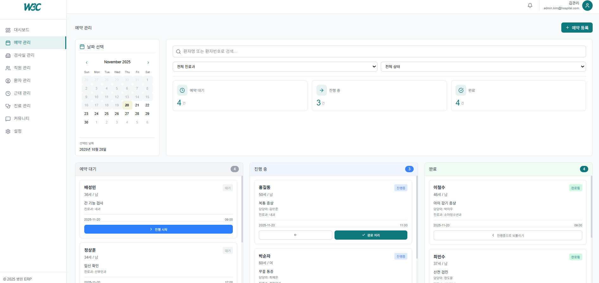
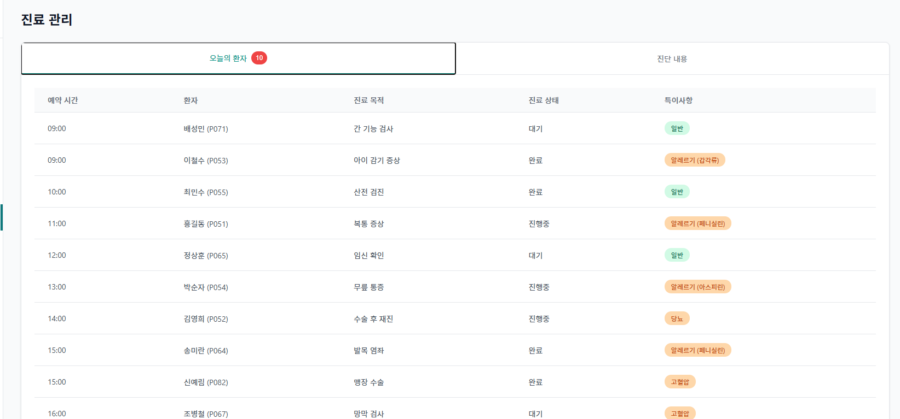
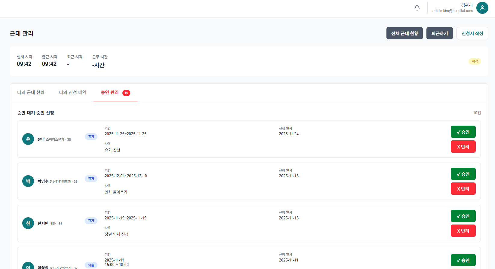

# W3C Project
병원 시설 관리와 예약 기능을 갖춘 JSP 기반 웹 애플리케이션 병원 ERP 시스템

## 개요 👋
W3C 프로젝트는 병원 내 특수장비(초음파, MRI 등) 예약 과정에서 발생하던 비효율적인 수작업을 개선하고,
예약·시설·회원·직원 정보를 하나의 시스템에서 통합 관리할 수 있도록 구축한 병원 ERP 시스템입니다.

기존에는 일반 진료 예약만 전산화되어 있었고,
특수장비 예약은 간호사와 시설관리자가 수동으로 조율해야 해 업무가 과도하게 증가하고
동일한 내용을 여러 번 확인해야 하는 비효율적인 구조가 존재했습니다.

본 프로젝트에서는 이러한 문제를 해결하기 위해 다음 기능들을 개발하여 실제 동작 가능한 형태로 구현했습니다.

- 실시간 시설·장비 예약 관리

- 병원의 시설예약 현황을 투명하게 공개

- 직원·회원 관리 및 권한 설정

- 예약 등급에 따른 우선순위 처리

- 커뮤니티(공지/문의) 기능 및 검색·필터링 지원

- 대시보드 통계 시각화 및 병원 운영 현황 조회


이 시스템은 병원 내 업무 효율성을 높이고 인력 낭비를 줄이는 것을 목표로 하며,
특수장비 예약뿐 아니라 전반적인 병원 운영을 통합적으로 관리할 수 있는 ERP로 완성되었습니다.

## 🧱 기술 스택 (Tech Stack)
| 구분 | 사용 기술 |
|------|------------|
| Frontend | HTML, CSS, JavaScript, JSP |
| Backend | Java (Spring Boot, JDBC, MyBatis)|
| Server| Apache Tomcat |
| Database | Oracle |
| Tools | InteliJ, Git, GitHub |

## 🛠️ 설치 및 실행 (Installation & Run)
## 1. 프로젝트 클론
git clone [https://github.com/Team-W3C/W3C-Project.git]

## 2. 데이터베이스(Oracle) 설정
- Oracle 실행 후 데이터베이스 및 테이블 생성
- src/main/webapp/WEB-INF/classes/sql 폴더 내 SQL 스크립트 실행
- JDBC 연결 정보(application.properties) 수정

## 3. 웹 애플리케이션 실행
- 브라우저에서 접속
http://localhost:8001

## 📂 프로젝트 구조 (Directory Structure)

```text
project/
├── src/main/java/com/w3c/spring/
│   ├── config/             # 설정 클래스 (Security 등)
│   ├── controller/         # 웹 컨트롤러 (Controller)
│   ├── model/
│   │   ├── dto/            # 데이터 전송 객체 (DTO)
│   │   ├── mapper/         # MyBatis 매퍼 인터페이스
│   │   └── vo/             # 값 객체 (VO)
│   └── service/            # 비즈니스 로직 (Service)
│
├── src/main/resources/
│   ├── mappers/            # MyBatis XML SQL 매핑 파일
│   └── static/             # 정적 리소스 (CSS, JS, Image)
│
├── src/main/webapp/
│   └── WEB-INF/
│       └── views/          # JSP 뷰 페이지
│
└── README.md
```

## 🌟 주요 기능 (Key Features)
✅ 회원가입 / 로그인 / 로그아웃 기능
✅ 게시글 등록, 조회, 수정, 삭제 (CRUD)
✅ Oracle DB 연동을 통한 데이터 관리
✅ MVC 패턴 기반 구조로 모듈화된 개발
✅ JSP include를 통한 공통 레이아웃 구성

## 💡 학습 포인트 (Learning Points)

- JSP & Spring Boot, MyBatis 기반 MVC 구조 설계 방법 학습
- JDBC를 통한 데이터베이스 연결 및 SQL 처리 로직 구현
- Tomcat 서버를 활용한 배포 및 실행 환경 이해
- JSP 내 JSTL / EL 사용으로 동적 페이지 구현
- git 협업 툴 학습


| 기능 | 미리보기 |
|------|-----------|
| 메인 화면 |  |
| 병원 진료 예약  |  |
| 시설 예약 현황 |  |
| 문의사항 |  |
| ERP 대시보드 |  |
| 직원 관리 |  |
| 환자 관리 |  |
| 예약 관리 |  |
| 진료 관리 |  |
| 직원 근태 관리 |  |


## 📂 Commit convention-

| prefix   | definition                                                      |
|----------|-----------------------------------------------------------------|
| feat     | 새로운 기능을 추가할 경우                                        |
| fix      | 기능을 수정하는 경우                                             |
| chore    | 프로젝트를 설정하는 경우                                         |
| ui       | UI, 스타일 관련 파일 추가 및 수정                               |
| build    | 빌드 관련 수정                                                  |
| ci       | CI 관련 설정 수정                                               |
| docs     | 문서 파일 추가 및 수정                                           |
| style    | 코드 스타일, 포맷팅에 대한 수정                                 |
| refactor | 기능의 변화가 아닌 코드 리팩터링 (예: 변수 이름 변경)           |
| test     | 테스트 코드 추가/수정                                           |
| release  | 버전 릴리즈                                                      |

## 깃 이슈
feat: 로그인 구현 기능

## 깃 브랜치
feat/1-login-feature

## 깃 커밋
feat: 로그인 구현 기능 #1

## 팀원 소개

| 이름 | GitHub | 이메일 | 역할 |
|------|--------|---------|------|
| 최승호 | [](https://github.com/Coseung) | [dreamdpsh@gmail.com](mailto:dreamdpsh@gmail.com) | 조장 |
| 신동호 | [](https://github.com/ICEH0TCH0C0) | [ICEH0TCH0C0@gmail.com](mailto:ICEH0TCH0C0@gmail.com) | DB 관리자 |
| 조치호 | [](https://github.com/xxh3898) | [chiho3898@gmail.com](mailto:chiho3898@gmail.com) | DB 관리자 |
| 신한서 | [](https://github.com/hanseo-lab) | [hanseo.lab@gmail.com](mailto:hanseo.lab@gmail.com) | 이슈 관리자 |
| 이채진 | [](https://github.com/sleepEjin) | [jinking0930@gmail.com](mailto:jinking0930@gmail.com) | 일정 관리자 |
| 장원석 | [](https://github.com/1suk) | [jang1suk9155@gmail.com](mailto:jang1suk9155@gmail.com) | 형상 관리자 |


